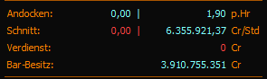
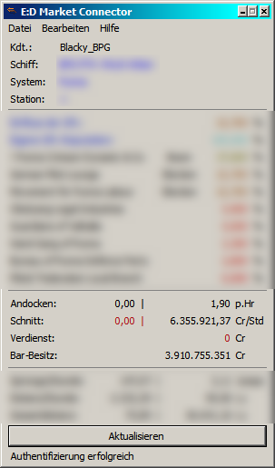
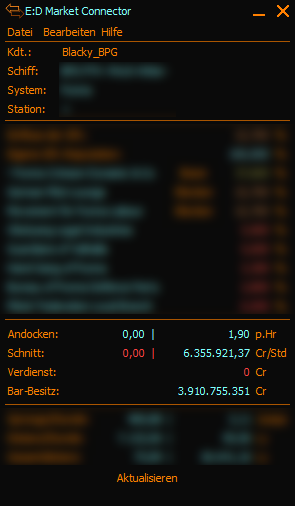

# Hourly Income EDMC Plugin

Das ist ein einfaches Plugin für den [ED MarketConnector](https://github.com/EDCD/EDMarketConnector/wiki), basierend aufdem Original [EDMC-HourlyIncome](https://github.com/Exynom/EDMC-HourlyIncome) vom Exynom!



 


## Installation

So wie auch alle anderen EDMC-Plugins wird der Ordner aus dem heruntergeladenen Archiv in den Plugin-Ordner eures EDMC's entpackt, das sollte danach dann in etwa so aussehen:
```
$AppPath$\EDMarketConnector\plugins\HourlyIncome
```
Nach dem starten des EDMC ist das Plugin sofort einsatzbereit, es ist bereits kompatibel mit der neuen BETA-Version des EDMC 3.99.1.0 (4.0.0.0 beta1), funktioniert jedoch auch in der Version 3.46 des EDMC.


## Anzeigen

Es wird folgendes im Plugin angezeigt:

- Zeile 1:
- - Links: Andockrate pro Stunde dieser Sitzung
- - Rechts: Andockrate pro Stunde gesamte Spielzeit
- Zeile 2:
- - Links: Durchschnittsverdienst pro Stunde dieser Sitzung
- - Rechts: Durchschnittsverdienst pro Stunde gesamt Spielzeit
- Zeile 3:
- - komplettes Einkommen dieser Sitzung
- Zeile 4:
- - aktueller Bar-Besitz (so wie er auch im Spiel angezeigt wird)

Negative Zahlen werden zusätzlich in ROT dargestellt.
Die Zeit die ein Profil gespielt wurde sowie der aktuelle Bar-Besitz wird beim Laden des Spieles (also EDMC vorher starten) abgefragt.
Die Gesamtanzahl der Andockvorgänge wird erst mitgeloggt ab dem ersten benutzen des Plugins, dieser Wert wird zwischengespeichert.
Der Durchschnittsverdienst der gesamten Spielzeit wird automatisch errechnet anhand des aktuellen bar-Besitzes sowie der gesamten Spielzeit, die Werte welche für die Sitzung gültig sind werden eben nur für die Einnahmen und Ausgaben auf die Spielzeit der Sitzung berechnet. Selbige Berechnung gilt für die Andockvorgänge.


## Wichtiges

~~Das Plugin erkennt nicht automatisch welches Design (Theme) man in EDMC aktiviert hat, weshalb es eine Optionsseite mit der möglichkeit der Designwahl für das Plugin gibt.~~


## Weiteres

Dieses Plugin ist lediglich für eigene statistische Auswertungen gedacht und synchronisiert sich selbst in keinster Weise mit irgendwelchen anderen Plattformen.
Für jene welche in anderen Sprachen spielen ist es möglich weitere Übersetzungsdateien an zu legen, diese kommen dann ebenso wie die deutsche Übersetzung in den L10n Ordner innerhalb des Plugin-Ordners.
